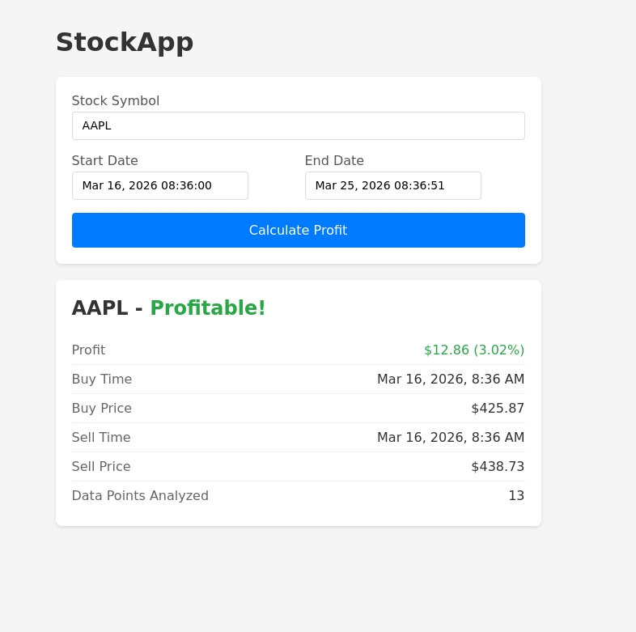

# StockApp

A web application that analyzes stock price data to find the optimal buy and sell points for maximum profit within a given time range.



## Features

- **Stock Profit Calculator**: Enter a stock symbol and date range to find the best buy/sell opportunity
- **Real-time Price Simulation**: Collector service generates simulated stock prices for Fortune 500 companies
- **REST API**: Query profit calculations via `/api/profit` endpoint

## Quick Start

### 1. Clone the repository

```bash
git clone https://github.com/gotha/stockapp.git
cd stockapp
```

### 2. Start all services

```bash
docker-compose up -d
```

This will start:
- PostgreSQL database on port `5434`
- API server on port `3000`
- Web app (client) on port `8081`
- Collector service (service that immitates stock price changes every X seconds)

### 3. Use the app

1. Open [http://localhost:8081](http://localhost:8081) in your browser
2. Enter a stock symbol (e.g., `AAPL`, `NVDA`, `MSFT`, `GOOGL`)
3. Select a start and end date/time
4. Click "Calculate Profit" to see results

> **Note**: The collector needs to run for a while to accumulate price data. Query recent time ranges for best results.

Service endpoints:
- API Health: [http://localhost:3000/api/health](http://localhost:3000/api/health)
- API Docs: [http://localhost:3000/docs](http://localhost:3000/docs)
- OpenAPI schema [http://localhost:3000/openapi.json](http://localhost:3000/openapi.json)

## API Usage

### Calculate Profit

```sh
curl "http://localhost:3000/api/profit?symbol=AAPL&start=2026-01-01T00:00:00Z&end=2026-01-02T00:00:00Z"
```

Response (profitable):
```json
{
  "symbol": "AAPL",
  "profitable": true,
  "profit": 5.25,
  "profitPercentage": 3.5,
  "buyTime": "2026-01-01T09:30:00.000Z",
  "buyPrice": 150.00,
  "sellTime": "2026-01-01T14:00:00.000Z",
  "sellPrice": 155.25,
  "dataPoints": 100
}
```

Response (no profitable trade):
```json
{
  "symbol": "AAPL",
  "profitable": false,
  "profit": 0,
  "profitPercentage": 0,
  "buyTime": null,
  "sellTime": null,
  "buyPrice": null,
  "sellPrice": null,
  "dataPoints": 50
}
```

## Development

### Dev environment

Reproducible dev environment can be created with [nix](https://nixos.org/download/)

```sh
nix develop
# or if you use direnv
direnv allow .
```

### Local Development

```bash
cp .env.example .env
# change the .env variables if needed

# Install dependencies
cd server && pnpm install
cd ../client && pnpm install

# Start database
docker-compose up -d db

# Start API server
cd server
pnpm run dev:serve

# Start collector
cd server
pnpm run dev:collect-stock-data

# Start web app
cd client
pnpm dev
```

### Future development

Some features were omitted from the current implementation for the sake of simplicity.

- CI/CD pipeline that publishes build artifacts in registry (ex. docker images)
- More production ready deployment configuration (ex. k8s deployments, helm charts, etc)
- log collection/aggregation and alerts - (depending on the stack - ELK, fluentd, Splunk)
- Monitoring dashboards with metrics and alerts (probably Grafana)
- services should expose metrics endpoint to be scraped by Prometheus (or similar)
- services includes OTEL traces/spans - distributed tracing
- frontend observability tools
- end-to-end UI test (like playwright)
- proper tool for handling database migrations (like prisma or knex)
- more robust API request validation - zod
- scalability / data volume optimizations - diverse set of techniques - from setting query constraints to migrating to more suitable database engine
- health endpoints will check dependencies


